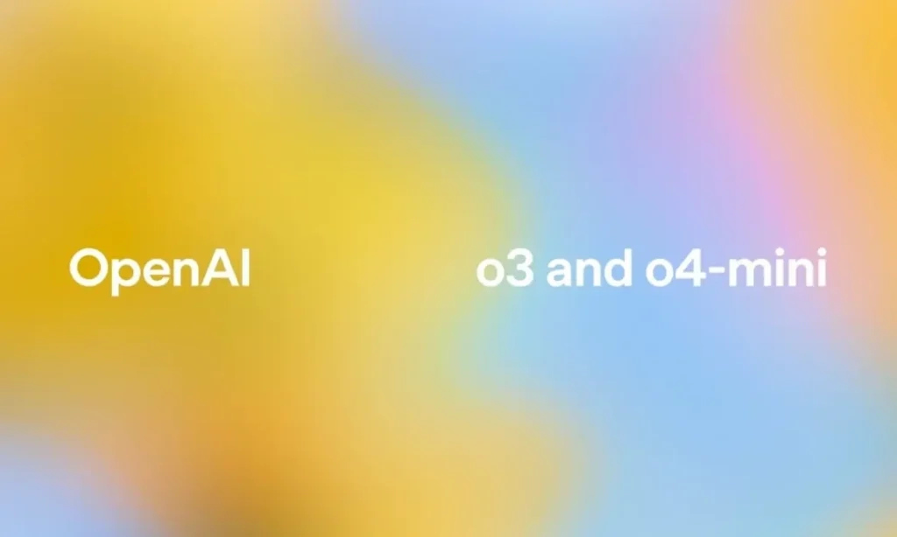

# ChatGPT Plus、Pro、Team 怎么选?看完这篇就够了

你可能听说 ChatGPT 现在有好几个版本——Plus、Pro、Team，还有免费版。价格从 0 到 200 美元一个月不等,功能也各不相同。到底该选哪个?别急,我们一个个说清楚。这篇文章会告诉你:每个版本能用什么模型、有什么功能、价格多少,以及最重要的——哪个最适合你。

---

## 先搞清楚这几个版本都是啥

**免费版(Free):**

就是最基础的 ChatGPT。你能用 GPT-3.5,偶尔也能用几次 GPT-4o(OpenAI 的旗舰模型),但用着用着就会告诉你"今天用完了,过几小时再来"。功能也很有限:能简单搜搜网页,但不能上传文件、不能让它帮你写代码、也没有那些高级研究模式。适合偶尔问问问题的人。

**ChatGPT Plus(20 美元/月):**

这是大多数人会选的版本。20 美元一个月,你能无限用 GPT-4o(当然还是有总消息数限制),还能用新出的 o3、o4-mini、o4-mini-high 这些推理模型。功能全开:语音聊天、视频对话、让 DALL·E 3 给你画图、上传文件分析、写代码、联网搜索……基本上你想要的都有了。

如果你经常用 ChatGPT 工作或学习,Plus 绝对物超所值。👉 [想直接体验完整版功能?这里有 ChatGPT 会员特价账号,质保30天](https://shaoyumi.com/buy/65),省去申请和支付的麻烦。

**ChatGPT Pro(200 美元/月):**

这个是给"重度用户"准备的——研究员、程序员、那些一天到晚离不开 AI 的人。Pro 包含 Plus 的所有功能,但关键是:几乎没有使用限制。你想用多少次就用多少次,不会突然告诉你"今天用完了"。而且 Pro 用户独享 OpenAI 最强的推理模型——o1、o1-mini、o1-pro 模式。还有一些实验性工具,比如 Sora 视频生成。一年下来 2400 美元,只有真正需要"超强算力"的人才会考虑。

**ChatGPT Team(25-30 美元/月/人):**

Team 是给小团队或公司用的。它包含 Plus 的所有功能,但消息限制大约是 Plus 的两倍,还有团队管理后台、共享的工作区、可以连接 Google Drive、默认不用你的数据训练模型(更安全)。如果你们是个小团队(至少 2 个人),按年付费是每人每月 25 美元,按月付是 30 美元。很适合需要协作的小公司或部门。

这里有个对比表,一眼看清楚:

| **版本** | **价格** | **能用的模型** | **主要功能** | **使用限制** |
|---------|---------|--------------|-------------|------------|
| **免费版** | $0 | GPT-3.5;少量 GPT-4o | 基础聊天,简单网页浏览 | 非常有限(约 10-60 条 GPT-4o 消息后锁定) |
| **Plus** | $20/月 | GPT-4o; o3, o4-mini, o4-mini-high | Plus 所有功能,语音/视频,DALL·E 3 画图,代码分析,联网 | GPT-4o 约 80 条/3小时;o3 约 40 条/3小时 |
| **Pro** | $200/月 | Plus 所有模型,外加 o1, o1-mini, o1-pro 模式 | Plus 所有功能,外加高级 o1 模式、Sora 视频、操作员预览 | 几乎无限制(只有滥用防护) |
| **Team** | $25/月/人(年付),$30/月/人(月付) | 与 Plus 相同 | Plus 所有功能,外加管理后台、安全工作区、团队 GPT、Google Drive 集成 | 约为 Plus 的 2 倍 |

## 这些 o3、o4-mini 都是啥?在哪儿能找到?

如果你是付费用户,在 ChatGPT 界面上方会看到一个模型选择器。点开它,你能选择用哪个"引擎"来回答你的问题:

**GPT-4o** – OpenAI 目前的主力模型,适合大多数任务。支持文字、图片、语音,还能用各种工具。所有付费版本都能用,只是限制不同。(免费用户只能用一点点)

**o3** – 最新的"高级"推理模型。OpenAI 说这是他们"最强的推理模型",特别擅长数学、编程、科学问题,还有看图(图表、图解)之类的复杂分析。比上一代 o1 少犯大约 20% 的错误。适合需要深度思考或创造性的问题。Plus、Pro、Team 用户都能用。

**o4-mini** – 更小、更快的版本,专门优化了效率。虽然小,但在数学、编程、看图方面表现出色,很多基准测试中甚至超过了早期的 o3-mini。因为体积小,所以使用限制更宽松,适合大量查询。Plus/Pro/Team 都有。

**o4-mini-high** – o4-mini 的"加强版",会多花一点计算资源,给你更全面的答案。相当于让 o4-mini"多想一会儿"。所有付费版本都能用。

**o1 和 o1-mini** – 上一代的推理模型。只有 Pro 用户能用,还有独家的"o1 专业模式"(用更多算力来保证准确度)。这些模型在数学、编程、逻辑方面很强,但对于大多数日常问题,OpenAI 还是推荐用 GPT-4o 或 o3。

简单说:**Plus 和 Team 用户能用 o3、o4-mini、o4-mini-high 和 GPT-4o**。**Pro 用户在此基础上还能用 o1 系列**。免费用户基本只有 GPT-3.5 和很少的 GPT-4o。

## 每个版本的使用限制到底是多少?

**免费版:**

GPT-4o 的限制非常紧。你可能只能发 10 条左右的消息,然后就得等几个小时才能再用。所以免费用户要省着用 GPT-4o,日常小问题用 GPT-3.5 就行。

**Plus:**

限制宽松多了。大约是 **GPT-4o 每 3 小时 80 条消息**,**o3 每 3 小时 40 条消息**。用不完也不会累积到第二天。Plus 还有"高峰时段优先访问",就是服务器再忙你也不会卡。对于正常使用来说,Plus 的限制完全够用。

**Team:**

比 Plus 的限制**大约翻倍**。据测试,Team 大约是每 3 小时 160 条 GPT-4o 消息。而且每个团队成员都有自己的配额,所以小团队基本不会用完。

**Pro:**

基本上**没有固定限制**。OpenAI 说是"无限制访问所有模型"。实际上就是你想用多少用多少,只要不是恶意滥用。Pro 是唯一一个可以不间断重度使用的消费级版本。

对于新的 o 系列模型,没有单独列出的配额,但会计入你的总使用限制。值得一提的是,**o4-mini** 因为体积小,限制相对宽松(OpenAI 说在 Plus 上可以"无限制"运行,因为它处理起来很轻松)。

## 价格到底多少钱?

OpenAI 的官方价格是美元,但各地区加税后会有些差异。截至 2025 年中:

- **ChatGPT Plus:** 每月 **20 美元**。欧盟/英国含税约 **22-24 欧元/18-20 英镑**。
- **ChatGPT Pro:** 每月 **200 美元**(一年 2400 美元)。欧盟/英国含税约 **220-240 欧元/180-200 英镑**。
- **ChatGPT Team:** 年付每人每月 **25 美元**,月付每人每月 **30 美元**(至少 2 人)。欧盟/英国年付含税约 **28-30 欧元/23-26 英镑** 每人每月。

OpenAI 的定价页面只列了 Plus 和 Team 的月费(Plus 没有年度折扣)。非营利组织偶尔有 20-25% 的优惠。

## 我该选哪个?

**偶尔用用/个人用户:**

如果你只是偶尔聊聊天,**免费版**够了。但如果你要正常工作或学习用,**Plus(20 美元/月)**是大多数人的最佳选择。Plus 大幅减少了等待时间,还加了核心工具(语音、代码、联网)。特别适合学生、内容创作者、自由职业者和独立专业人士。

**高级用户/重度使用:**

如果你发现自己经常用到 Plus 的限制,或者需要最大速度和特殊功能(比如 o1 模型),那 **Pro(200 美元/月)** 就是为你准备的。研究人员、工程师和跑 AI 密集型工作的人会喜欢"o1 专业模式"以及没有使用限制的体验。一个简单的判断标准:如果你总是撞到 Plus 的限制,或者需要保证随时可用,Pro 就值得。

**团队和企业:**

对于协作或商业用途,**ChatGPT Team**(每人 25-30 美元)提供 Plus 的功能,外加必要的管理和数据控制。任何 2 人以上的小组(营销团队、初创公司、代理机构)都应该考虑 Team。它增加了共享工作区、管理仪表板、独立计费,而且默认不用你的业务数据训练模型(更安全)。如果你们公司有 100 多人或涉及严格监管,可能要考虑企业版,但对于大多数小于 100 人的组织,Team 刚刚好。

**预算和功能:**

Team(年付)的每人成本最低,但要至少 2 个席位。个人专业人士和自由职业者从 Plus 得到的性价比最高。如果你的工作(头脑风暴、写作、编程)足以支撑每月 20 美元,Plus 就很"值"。Pro 的 10 倍价格只适合关键任务或大规模使用;大多数人用不着 Pro。

决策框架其实很简单:*"偶尔用:免费版;经常用:Plus;非常频繁用或需要最大性能:Pro;多人用:Team。"*

---

## 总结一下

2025 年,OpenAI 的 ChatGPT 有清晰的分层。**Plus**(约 20 美元/月)解锁 GPT-4o、新的 o3/o4 模型和大多数高级工具——对个人来说性价比最高。**Pro**(200 美元/月)为专家用户增加最强模型(带专业模式的 o1)和几乎无限的使用额度。**Team**(25-30 美元/月/人)镜像 Plus 功能,但增加了安全工作区、管理功能和双倍使用配额,专为业务团队设计。往下还有免费版,适合轻度使用。

选择时,匹配你的预期用途和协作/安全需求就行:大多数单人用户选 Plus,高级用户可能选 Pro,企业应该选 Team。

如果你想快速体验完整功能而不想折腾注册和国际支付,👉 [这里有 ChatGPT 会员特价账号(质保30天)](https://shaoyumi.com/buy/65),直接开始用就行了。
